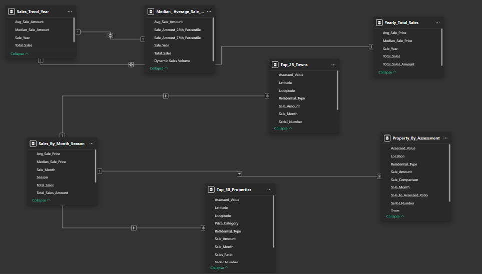

# Real_Estate_Sales

## Introduction.

### Real Estate Market Analytics Dashboard.

Have you ever wondered what drives property values in your area? This project answers that question by transforming raw **real estate** transaction data into actionable market intelligence. I developed this comprehensive dashboard to help stakeholders visualize $1.38 billion of property sales across multiple towns, revealing hidden patterns and market opportunities.

Using SQL for data extraction and transformation, I built queries that cleaned and structured complex property records into a meaningful datasets. The real magic happened in Power BI, where I designed interactive visualizations that allows users to instantly analyze market trends by property type, location, and time period.

The dashboard offers actionable insights including price trend analysis, seasonal sale patterns, and property value comparisons across different towns. Stakeholders can make data-driven decisions by understanding which areas consistently outperform their assessed values or how different property types perform across market cycles.

What started as raw transaction records has become a strategic tool that reveals the true story behind the numbers; whether you're a real estate investor looking for opportunities or a market analyst tracking long-term trends.

**_Disclaimer_** : _This **real estate sales** dashboard only presents historical property sales data for analytical and informational purposes. While efforts have been made to ensure accuracy, this information should not be used as financial advice or an indicator of future market performance. Property values, market trends, and sales figures may vary from current market conditions. Users should verify all information independently and consult qualified real estate professionals before making investment decisions. This dataset may contain aggregated information that excludes certain property types or transactions, and geographic coverage is limited to the specific towns displayed_.

## Issue Definition.

The local **real estate** authority lacks comprehensive visibility into property market trends across multiple towns, hindering informed decision-making for stakeholders. Currently, valuable sales data exists but remains fragmented across various systems, making it difficult to:

1. Compare property values against assessed valuations to identify under/overvalued markets.
2. Track seasonal discripancies in sales volume and pricing.
3. Analyze differences in sales performance between property types.
4. Identify towns and properties with high sales so as to suggest investment decisions.
5. Understand long-term market trends spanning over two decades (2000-2023)
This information gap prevents real estate professionals, investors, and policymakers from making data-driven decisions in a unique market where property values exceed $1.38 billion in total sales. A consolidated analytical solution is needed to transform this transactional data into actionable insights that reveal trends across location, time and property type.

## Skills/Concepts Demonstrated.
The following are the skills and concepts implemented in the **real estate sales** report.
1. **Data Visualization Technique**:
- Use of various chart type(bar chart, line chart, area chart and pie chart) to represent the **real estate sales** data.
- Percentile analysis visualization (25th and 75th percentiles).
- Comparative metrics display.
- Time series analysis visualization.
- Color-coded geographical performance indicators.

2. **Dashboard Design Skills**:
- Clean information hierarchy with KPI cards at the top.
- Logical grouping of related metrics.
- Interactive filtering capabilities.
- Balanced visual composition.
- Effective use of space with multiple coordinated views.

3. **Business Intelligence Skills**:
- Metric comparison(actual sales vs. assessed value).
- Trend analysis across two decades(2000-2023).
- Multi-dimentional analysis(town, period and property type).
- Seasonal sales pattern identification.
- Market performance indicator.

4. **Data Analysis Competence**:
- Aggregation at multiple levels(town, month,year).
- Statistical measures (averages, medians, percentiles).
- Ratio calculations (sale-to-assessed ratio).
- Geographic performance comparison.
- Price trend analysis over time.

5. **Technical Implementation**:
- Parameter controls for filtering.
- Synchronized visualizations.
- Custom calculations and metrics.
- Multi-measure charts.
- Data model relationships connecting different analysis views.

This dashboard effectively transformed complex **real estate** data into accessible insights that could help stakeholders identify market trends, property value patterns, and investment opportunities across different locations and periods.

## Data Modeling:

The **Real Estate Sales** Analytics Data Model uses a **star schema** design to make property market analysis more efficient and insightful. This approach lets users easily explore housing data from different angles - whether they're interested in location trends, time-based patterns, or specific property features. The data model was structured this way to create a balance between analytical power and performance, making it simple to dig into real estate transactions without sacrificing speed or flexibility.

1. **Schema Design**:

The data model implements a **star schema** with:
- Fact Tables: This table contains property sales quantitative measures.
- Dimension Tables: Providing contextual attributes for analyzing the facts.
This design is crafted to support efficient analytical queries, ensuring data integrity while allowing for flexible exploration of sales metrics from various angles. It provides a robust framework for in-depth analysis, enabling users to uncover insights and trends across different dimensions of real estate sales data.

2. **Tables and Relationships**:
   
   A. **Fact Tables**
   
   **Sales_Trend_Year**
   - Primary metrics for year-based analysis.
   - Fields: Avg_Sale_Amount, Median_Sale_Amount, Total_Sales

   **Median_Average_Sale**
   - Statistical distribution data for sales analysis.
   - Fields: Avg_Sale_Amount, Sale_Amount_25th_Percentile, Sale_Amount_75th_Percentile, Dynamic_Sales_Volume.
  
   **Yearly_Total_Sales**
   - Annual aggregation of sales performance.
   - Fields: Avg_Sale_Price, Median_Sale_Price, Sale_Year, Total_Sales, Total_Sales_Amount.
  
   B. **Dimension Tables**

   **Top_25_Towns**
   - Geographic dimension for town-level analysis.
   - Fields: Assessed_Value, Latitude, Longitude, Residential_Type, Sale_Amount, Sale_Month, Serial_Number.

   **Sales_By_Month_Season**
   - Temporal dimension for seasonal analysis.
   - Fields: Avg_Sale_Price, Median_Sale_Price, Sale_Month, Season, Total_Sales, Total_Sales_Amount.
  
   **Property_By_Assessment**

      
     

   

